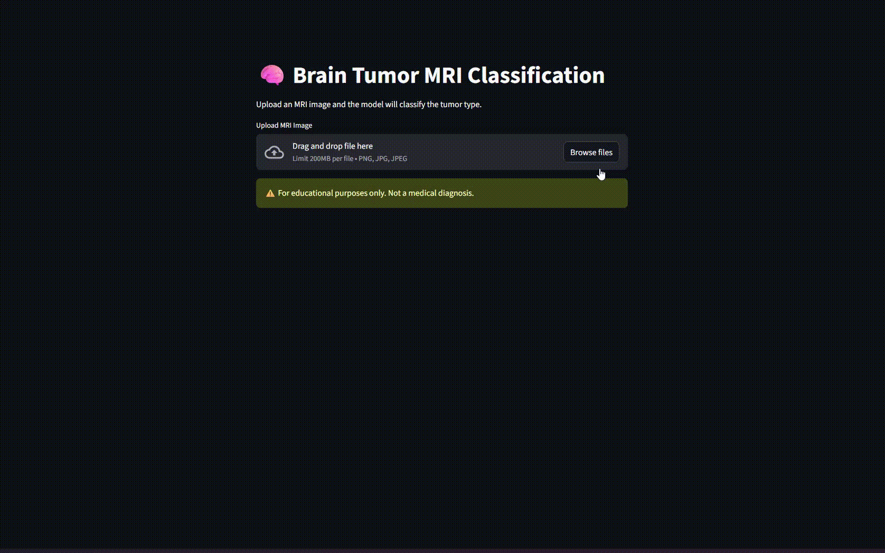

<a id="top"></a>

# Brain Tumor MRI Classification Using Hyperparameterized Custom Model
*A deep learning system for **brain tumor classification** using a **brain MRI image**, deployed via an **interactive streamlit demo***

<details>
<summary><strong>Table of Contents</strong></summary>

- [Demo](#demo)
- [Key Features](#key-features)
- [Model Architecture](#model-architecture)
- [Tech Stack (Requirements)](#tech-stack-requirements)
- [Initialization](#initialization)
- [Installation](#installation)
- [Usage](#usage)
- [Dataset Instructions](#dataset-instructions)
- [Project Structure](#project-structure)
- [Process](#process)
- [Results](#results)
- [Future Work](#future-work)
- [Disclaimer](#disclaimer)
- [Contact](#contact)
- [License](#license)

</details>

---

# Demo

<p align="center">
  <br>
  <em>Streamlit demo showcasing custom CNN Brain tumor classification model</em>
</p>

Steps to use this demo:<br>
<ol>
    <li>Upload the MRI brain scan image</li>
    <li>Click on the "run prediction" button and it will output the prediction as well as the confidence level
    </li>
</ol>

<div align="right">
  <a href="#top">Back to top ⬆</a>
</div>

---

# Key Features

- **Custom CNN Model**<br>Custom feature extractor model of the image input
- **Hyperparameterization**<br>Using skorch library and random search hyperparameter to better tune each model parameters
- **Streamlit Web Application**<br>A python-based library for real-time inference


<div align="right">
  <a href="#top">Back to top ⬆</a>
</div>

---

# Model Architecture
1. Fundus Image of an eye --> Custom Feature Extractor
2. Representation features --> MLP layer
5. One output head --> Classification of brain tumor

```text
Image --> Custom CNN model --> MLP layer --> output
```
<div align="right">
  <a href="#top">Back to top ⬆</a>
</div>

---

# Tech Stack (Requirements)
```markdown
- torch=2.9.1
- streamlit=1.52.2
- torchvision=0.24.1
- pillow=12.0.0
- transformers=4.57.3
- skorch=1.3.1
- pandas=2.3.3
- numpy=2.3.5
- seaborn=0.13.2
- matplotlib=3.10.7
- tqdm=4.67.1
- scikit-learn=1.8.0
- scipy=1.16.0
- python=3.11.14
```
```text
Notes: 
1. All requirements are provided in the requirements.txt file
2. Should users have an NVIDIA GPU that supports cuda, replace the following tech stack requirements
- torch=2.9.1+cu128
- torchvision=0.24.1+cu128
```
<div align="right">
  <a href="#top">Back to top ⬆</a>
</div>

---

# Initialization

The trained model weights are **not included in this repository** due to GitHub file size limitations.

## Download Instructions

1. Download the model weights from Google Drive:  
   👉 **[Download brain tumor_classifier.pth](https://drive.google.com/file/d/1kRCCjWNysVGoCiwznNDbcV-ey8TAJWY1/view?usp=sharing)**

2. After downloading, place the file in the following directory:
```text
model/
└── brain_tumor_classifier.pth
```

## Dataset Instructions

This project uses a retinal fundus dataset with clinical captions.

Due to licensing and privacy restrictions, the dataset cannot be redistributed.

### How to obtain the dataset
1. Download from: [\[Dataset Source\]](https://www.kaggle.com/datasets/masoudnickparvar/brain-tumor-mri-dataset)
2. Place files in: ```data/```

### (Optional) How to obtain csv for notebook
1. In the ```src/tools/``` folder, run the ```dataset_curation.py``` file. Ensure that the dataset source is installed properly in the correct directory!

<div align="right">
  <a href="#top">Back to top ⬆</a>
</div> 

---

# Installation
1. Clone the github repository using the command below in the command prompt/ terminal
```bash
git clone https://github.com/ReubenZSTechs/Brain-Tumor-Classification.git
```

2. Locate the folder
```bash
cd Brain-Tumor-Classification
```

3. Install the virtual environment using the requirements.txt file
```bash
pip install -r requirements.txt
```

4. Should advance users wish to use CUDA-supported NVIDIA GPU, users can delete the pytorch and torchvision installation from the ```requirements.txt``` and run the command below in the command prompt/ terminal

```bash
pip install torch torchvision --index-url https://download.pytorch.org/whl/cu128
```

<div align="right">
  <a href="#top">Back to top ⬆</a>
</div>

---

# Usage
1. Verify whether the streamlit library is installed properly
```bash
streamlit --version
```

2. If streamlit library is installed, run the following command in the command prompt
```bash
streamlit run app.py
```

3. The command will bring you to the website using your default browser.

<div align="right">
  <a href="#top">Back to top ⬆</a>
</div>

---

# Project Structure
```text
├── app.py
├── inference.py
├── model/
│   └── brain_tumor_classifier.pth
├── assets/
│   └── demo.gif
├── data/
│   └── csv/
│       └── directory_dataset.csv
│       └── test.csv
│       └── train.csv
│   └── img/
│       └── Testing/
│           └── glioma/
│           └── meningioma/
│           └── notumor/
│           └── pituitary/
│       └── Training/
│           └── glioma/
│           └── meningioma/
│           └── notumor/
│           └── pituitary/
├── src/
│   └── model_training/
│       └── classification_model.ipynb
│   └── tools/
│       └── dataset_curation.py
├── requirements.txt
└── README.md
```

<div align="right">
  <a href="#top">Back to top ⬆</a>
</div>

---

# Process
1. Use the ```dataset_curation.py``` file to generate ```directory_dataset.csv``` and the training, testing, and validation csv files.
2. Wrap all images under one DataClass and use DataLoader to load the data for the model.
3. Do an exploratory data analysis on the image data.
4. Train the custom CNN model without any hyperparameter process involved.
5. Use a custom hyperparameterization process to find the best parameters.
6. Retrain the model based on the best parameters found.
7. Test the model against the testing images and evaluate performance.
8. Save the model for inferencing.

<div align="right">
  <a href="#top">Back to top ⬆</a>
</div>

---

# Results
**ROC-AUC**
<table>
  <tr>
    <td>glioma</td>
    <td>0.9773</td>
  </tr>
  <tr>
    <td>Meningioma</td>
    <td>0.9139</td>
  </tr>
  <tr>
    <td>Notumor</td>
    <td>0.9916</td>
  </tr>
  <tr>
    <td>Pituitary</td>
    <td>0.9890</td>
  </tr>
</table>

```text
Notes: All results and the training process of the model is available on classification_model.ipynb notebook (See Project Structure for location)
```

<div align="right">
  <a href="#top">Back to top ⬆</a>
</div>

---

# Future Work
1. Using a much more deeper CNN model, like ResNet50.
2. Using a deeper MLP layer to better classify the image without overfitting.
3. Mobile Application Deployment for easier and faster use, preferably using Docker

<div align="right">
  <a href="#top">Back to top ⬆</a>
</div>

---

# Disclaimer
This project is for **research and educational purposes only**. It is **not a medical device** and must not be used for clinical diagnosis.

<div align="right">
  <a href="#top">Back to top ⬆</a>
</div>

---

# Contact
Name    : Reuben Zachary Susanto<br>
Contact : reuben.zachary.rz@gmail.com

<div align="right">
  <a href="#top">Back to top ⬆</a>
</div>

---

# License
Distributed under the MIT License. See ```LICENSE``` for more information

<div align="right">
  <a href="#top">Back to top ⬆</a>
</div>
